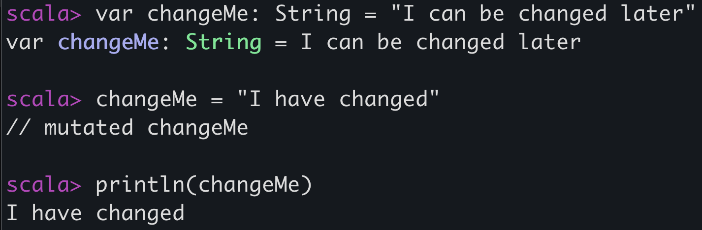
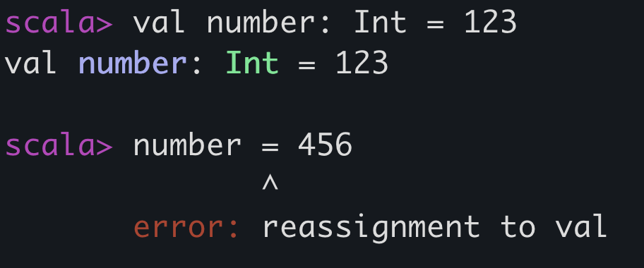

# Scala School 2026

## Prerequisites

Scala runs on the JVM (Java Virtual Machine), so **you must have Java installed** on your computer in order to run Scala code.

You can install [Java](https://www.java.com/en/) in a number of different ways. Here's how you do it using `mise`:

```
$ mise install java@<version>
```
where `<version>` is the Java version you want to install.

You'll also need to download [`sbt`](https://www.scala-sbt.org/) which you can do using `mise` as well:
```
$ mise install sbt@latest
```

SBT (Scala Build Tool) is a Scala project builder. This is the tool that builds our Scala project for us.

You might need to also install [OpenJDK](https://openjdk.org).


## Getting started

### Setting up a new project

See https://www.scala-sbt.org/1.x/docs/sbt-by-example.html for instructions on how to set up a new Scala project using SBT.

It is also possible to run a command that generates a project from scratch to speed things up. e.g.
```
$ sbt new scala/scala-seed.g8
```
which uses giter8, an sbt project generator, https://github.com/scala/scala-seed.g8.

This will generate a project structure using Scala 2. We'll be using Scala 2 throughout this course but Scala 3 is also available, with slightly different syntax in places.

The previous command will generate a project with a structure similar to this:
```
.
└── scala-seed-project/
    ├── project/
    │   ├── build.properties
    │   └── Dependencies
    ├── src/
    │   ├── main/
    │   │   └── scala/
    │   │       └── example/
    │   │           └── Hello
    │   └── test/
    │       └── scala/
    │           └── example/
    │               └── HelloSpec
    ├── .gitignore
    └── build.sbt
```

Notice how we have a `build.sbt` file at the root, a little like a `package.json` in Node.

### build.sbt

This describes how the project will be built and processed. It sets some settings and metadata for your package:
- which scala version you're using
- which version this is
- the organisation name and prefix for your package
- library dependencies to install

#### Organization

It's common in Scala to use a sort of reverse domain as your package prefix. For example if your company domain was www.example.com, the package name would be prefixed with `com.example`.

E.g. Apache (https://apache.org/) has a Scala package called Log4j. The name of the package is [`org.apache.logging.log4j`](https://mvnrepository.com/artifact/org.apache.logging.log4j) where we have reversed the domain name and used that to prefix the package name. 

The Guardian used to own the domain `gu.com` so prefixed the Scala packages with the string `com.gu`. The `gu.com` domain has since been sold but we still use this organisation prefix in our Scala packages today. See https://mvnrepository.com/search?q=com.gu

#### Dependencies

Describes which other libraries you need to install in your project.
By convention, Scala packages use `%%` whereas Java packages use `%`

For example, if we are installing the Scala `Play JSON` library, we do this by adding this to our list of dependencies:
```sbt
  // Scala
  "org.playframework" %% "play-json" % "3.0.6"
```

If we want to install a Java dependency in our Scala project, we need to use a single `%` instead of double (`%%`) e.g. AWS S3
```sbt
  // Java
  "software.amazon.awssdk" % "s3" % "2.44.4"
```

_You can learn more about SBT and how to set up a project in Lesson 3 of Get Programming With Scala by Daniela Sfregola._

### Which IDE

IntelliJ is the Guardian's recommended IDE for working with Scala.
You can also use VSCode, by installing the [Metals](https://scalameta.org/metals/docs/editors/vscode) extension.

## Basic Syntax

### Values and Variables

- **Variables** are mutable (can be reassigned)
- **Values** are immutable (cannot be reassigned)

Variables are defined using the keyword `var`. These are uncommon.
```scala
var changeMe: String = "I can be changed later"
changeMe = "I have changed"
println(changeMe) // `println` prints the value to the console
```

<!--  -->


It is **much** more common to use `val`, the value keyword.

```scala
val number: Int = 123
```

<!--  -->


Scala is a **typed** language. It can often infer types based on code that has been written already but often its best for us to take control and specify that ourselves for a variety of reasons.

Here are a list of types in Scala 2: https://www.scala-lang.org/api/2.13.5/scala/index.html

#### Print statements

`println` is a function that prints to the console. We call it with the argument we want to print:

```scala
// Print the text "Hello world!" to the console
println("Hello world!")
```

#### Comments

```scala
// I am a single line comment
val bigNumber: Long = 9876543210

/**
 * I am a multi-line comment
 * I can also act as documentation for the line underneath
 */
val notDefinedYet = ??? // ??? means not implmented yet
```

#### Blocks

You can combine expressions by surrounding them with `{}` which is called a "block". This is a group of code which is evaluated together. The following example shows the `println` function being called with a block of code which evaluates to the string "Hello world!"

```scala
println({
  val hello = "Hello"
  hello + " world!"
})
// Prints "Hello world!"
```

In Scala, we often don't explicitly `return` anything. The result of a block is the last line evaluated in that block.

#### Functions

```scala
/** This function converts an integer to a string type */
def myFunction(int: Int): String = {
  s"$int" // String interpolation using "s" strings
}
```

#### String interpolation

_s_ interpolator
```scala
// "s" interpolator
val colour = "blue"
println(s"My favourite colour is $colour")

// Using blocks 
println(s"My favourite colour is ${"dark " + colour}")
```

#### Operations

Mathematical operations like

```scala
val addition = 1 + 2 // 3
val addition2 = addition += 1 // adds 1 to the `addition` value
val subtraction = 2 - 1 // 1 
val multiplication = 2 * 2 // 4
val division = 1 / 2 // 0.5
val modulo = (2 + 1) % 2 // 1
val equals = 1 == 1 // true
val doesNotEqual = 1 != 2 // true
```

Note: `==` double equals means "is equal to". `=` single equals is for _assignment_.

#### Collections

**Lists**

Lists in Scala are immutable 
```scala
// List is both a type and a constructor.
// Square brackets for the type, standard brackets for the constructor
val myList: List[Int] = List(1, 2, 3) 

// head of the list
myList.head // 1
// tail of the list
myList.tail // List(2, 3)

// destructures head and tail from myList as above
val head :: tail = myList

// add 0 to start of list
0 :: myList // List(0, 1, 2, 3)
// add 4 to end of list
myList :: 4 // List(1, 2, 3, 4)

val anotherList = List(9, 8, 7)

// combine both lists into one
myList ++ anotherList // List (1, 2, 3, 9, 8, 7)

// prepends myList as the first element of anotherList
myList +: anotherList // List(List(1, 2, 3), 9, 8, 7)
// appends anotherList as the last element of myList
myList :+ anotherList // List(1, 2, 3, List(9, 8, 7))
```


### Conditional Constructs & Loops

#### If-else

If-else is very similar in Scala as it is in other programming languages.
```scala
if (condition) {
  // expression
} else if (otherCondition) {
  // expression
} else {
  // expression
}
```
Notice how each of these is a *block* of code. You can omit the blocks like so:

```scala
def label(n: Int) = {
  if (n == 0) "neutral"
  else if (n < 0) "negative"
  else "positive"
}
```
_The above example was taken from Lesson 5 of Get Programming with Scala by Daniela Sfregola_

#### While loop

Rarely used in Scala but here as information:

```scala
while (condition) {
  expression
}
```

Example
```scala
def greet(times: Int) = {
  var i = times 
  while (i > 0) {
    println("Hello world!")
    i -= 1 // subtract 1 from i
  }
}
```

#### For loop
```scala
for (condition) {
  expression
}
```

Example
```scala
def greet(times: Int) = {
  for (i <- 1 to times) {
    println("Hello world!")
  }
}
```

### Functions

As in any programming language, functions are blocks of code that provide instructions on how to achieve a specific task. 
Function declarations in Scala have:
- a keyword: `def`
- a function name
- function arguments and their types
- a return type of the function
- the function body

```scala
def myFunction(arg1: String, arg2: Int): List[String] = {
  // function body
}
```

For example, the function `add` can be written like so:

```scala
def add(x: Int, y: Int): Int = x + y
```

Or the function `greet` which prints a greeting:

```scala
def greet(name: String): Unit = println(s"Hello, $name!")
```

It is often good practice to think about your types before your implementation.
Scala provides a symbol to allow us to think like this: `???`
This allows you to write your function declaration first without the function body, simply leaving `???` as a `TODO` comment for yourself which essentially stands for "not implemented yet". This allows the code to compile without being complete.

```scala
def notImplementedYet(input: Any): Unit = ???
```

For more information on functions, read Lesson 6 of _Get Programming with Scala_ by Daniela Sfregola.

## Homework

Set up your own Scala project by following the example in the SBT set up guide: https://www.scala-sbt.org/1.x/docs/sbt-by-example.html


## Additional Reading

Lessons 4, 5 and 6 of _Get Programming with Scala_ by Daniela Sfregola.
